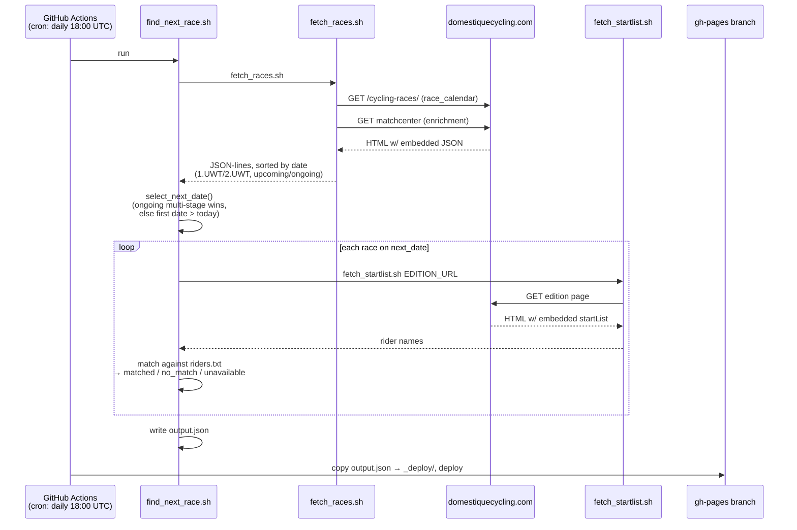

# Pied Biker

A daily GitHub Action that finds the next UCI Men's Elite road race (WorldTour)
featuring any rider on a personal watchlist, and publishes the result as a
static JSON file on GitHub Pages.

Shell scripts + `jq` only — no runtime dependency, no server. See
[CLAUDE.md](CLAUDE.md) for the guiding principles and [REQUIREMENTS.md](REQUIREMENTS.md)
for full functional detail.

## Workflow



## Files

- `riders.txt` — watchlist, one rider name per line (`firstName lastName`, matching Domestique's startlist format)
- `find_next_race.sh` — orchestrator: picks the next race date and matches riders against its startlist
- `fetch_races.sh` — scrapes Domestique's race calendar + matchcenter enrichment
- `fetch_startlist.sh` — scrapes a race edition's startlist
- `output.json` — generated result, published to the `gh-pages` branch (see [output.json.example](output.json.example) for shape)
- `.github/workflows/update-with-next-race.yml` — the scheduled GitHub Action
- `LADRs/` — lightweight architecture decision records explaining key choices

## Local usage

```sh
chmod +x *.sh
./find_next_race.sh   # writes output.json
```

Set `BIKE_BUDDY_DEBUG=1` in `.env` to log verbose progress to `debug.log`.

Run `./test.sh` to exercise `find_next_race.sh`'s date-selection logic against fixture data.
